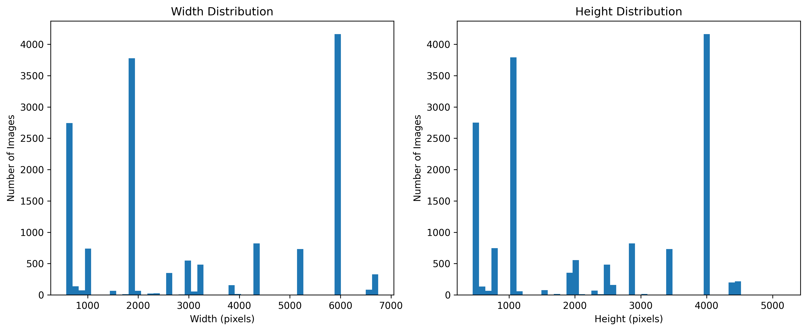

# Melanoma Detection Data Pipeline: ISIC Data Retriever & Processor

## Overview

This dir provides an automated pipeline for downloading, preprocessing, and preparing melanoma image datasets, primarily sourced from the ISIC (International Skin Imaging Collaboration) Archive, for use in machine learning, particularly for training neural networks for melanoma detection.

A core motivation behind the development of this pipeline was to address the common and significant challenge of **class imbalance** frequently observed in medical imaging datasets, specifically the disparity between 'benign' and 'malignant' lesion samples. Furthermore, the pipeline is designed to systematically apply crucial **image transformations** necessary for standardizing input and augmenting data for robust model training.

The pipeline automates several stages:
1.  **Data Download**: Retrieval of multiple ISIC dataset collections.
2.  **Data Merging**: Consolidation of these datasets into a unified structure.
3.  **Data Transformation**: Application of image preprocessing and augmentation techniques.
4.  **Data Visualization & Analysis**: Generation of dataset statistics and visualizations to understand data characteristics (as exemplified by the initial analysis plots).
5.  **Final Preparation**: Organization of data into a structure suitable for neural network training workflows.
6.  **Cleanup**: Automated cleanup of temporary files and directories.

## Key Rationale and Design Philosophy

* **Addressing Class Imbalance:** Medical datasets, especially for conditions like melanoma, often present a severe imbalance where benign cases far outnumber malignant ones. This pipeline was built with the goal of facilitating the creation of a more balanced dataset. While the final balancing strategy (e.g., undersampling the majority, oversampling the minority, or creating a specific balanced subset as done in my experiments leading to a ~2k balanced dataset from ~15k initial samples) might be implemented on the *output* of the `data_merger.py` or within `data_final_prepare.py`, the entire data aggregation and structuring process is designed to make this critical step more manageable and reproducible. The aim is to enable models to learn effectively from both classes without being overly biased towards the majority.
* **Essential Image Transformations:** Deep learning models require consistent input. This pipeline incorporates image transformation steps (`data_transformer.py`) such as resizing to a uniform dimension, normalization of pixel values, and data augmentation (e.g., rotations, flips) to increase the diversity of the training set and improve model generalization.
* **Reproducibility and Automation:** To ensure experiments are reproducible and to save manual effort, the entire workflow from download to final preparation is automated.

## Features

* Automated download of multiple ISIC dataset collections with progress tracking.
* Robust error handling and retry mechanisms during downloads.
* Consolidation of various datasets and deduplication of redundant data.
* Unified metadata management.
* Configurable image preprocessing including resizing, normalization, and artifact considerations.
* Data augmentation capabilities via `albumentations`.
* Comprehensive dataset statistics generation and visualization (distributions, missing data, image dimensions).
* Structured directory hierarchy for outputs.
* Functionality for splitting data into train/validation/test sets.
* Automated cleanup of intermediate files.

## Directory Structure

The core logic is organized within the `data_retriever/` directory:

```
data_retriever/
├── main.py                 # Main pipeline orchestrator: runs all stages in sequence.
├── downloader.py           # Manages dataset downloads from specified URLs.
├── data_merger.py          # Consolidates images and metadata from various downloaded datasets.
├── data_transformer.py     # Applies image preprocessing and augmentation.
├── data_visualizer.py      # Generates statistics and visualizations about the dataset.
├── data_final_prepare.py   # Prepares the data in the final format for neural network training (e.g., train/val/test splits).
└── dir_cleaner.py          # Handles cleanup of temporary directories.
```

## Pipeline Stages Explained

1.  **Data Download (`downloader.py`)**: Fetches specified ISIC dataset ZIP files from their respective URLs.
    * **User Customization**: This is the primary module a user would modify by updating the list of URLs to download different or newer datasets.
2.  **Data Merging (`data_merger.py`)**:
    * Extracts images and metadata from all downloaded ZIPs.
    * Combines images into a single `images/` directory and merges metadata into a unified `metadata.csv` file, handling potential duplicates. This step is crucial for creating a comprehensive dataset view before any balancing.
3.  **Data Transformation (`data_transformer.py`)**:
    * Applies defined image processing techniques: resizing to a standard dimension, normalization.
    * Can be configured to apply data augmentation to increase training set variability. This is vital for training robust deep learning models.
4.  **Data Visualization (`data_visualizer.py`)**:
    * Analyzes the merged and/or transformed dataset.
    * Generates plots for class distributions (like `benign_malignant`, `anatom_site_general`, `sex`), age distribution, image dimension distributions, and missing value percentages. This helps in understanding the dataset's characteristics and identifying potential biases beyond class imbalance.
5.  **Final Preparation (`data_final_prepare.py`)**:
    * Organizes the processed and potentially balanced data into `train/`, `validation/`, and `test/` directories, often with images sorted into class-specific subfolders.
    * This stage would work upon the (potentially manually or semi-automatically) balanced dataset derived after the merging and initial analysis.
6.  **Cleanup (`dir_cleaner.py`)**: Removes intermediate files like the downloaded ZIPs to save space.

## Output Structure

The pipeline generates a structured output:

```
data_retriever/
├── downloaded_zips/        # Raw downloaded datasets (can be cleaned up).
├── merged_data/            # Consolidated raw data before transformations.
│   ├── images/
│   └── metadata.csv
├── data_transformed/       # Dataset after image preprocessing and augmentation.
│   ├── images/
│   └── metadata.csv
├── data_visual_repr/       # Directory for storing generated analysis visualizations.
├── neural_network_data/    # Final data structured for neural network training.
│   ├── train/
│   │   ├── class_A/
│   │   └── class_B/
│   ├── validation/
│   │   ├── class_A/
│   │   └── class_B/
│   └── test/
│       ├── class_A/
│       └── class_B/
└── logs/                   # Pipeline execution logs.
```

## Requirements

Python 3.x and the following packages:
```
numpy>=1.21.0
pandas>=1.3.0
matplotlib>=3.4.0
seaborn>=0.11.0
Pillow>=8.3.0
opencv-python>=4.5.0
scikit-learn>=0.24.0
albumentations>=1.0.0
requests>=2.26.0
tqdm>=4.62.0
```
You can install them using:
`pip install -r requirements.txt` (assuming you create this file).

## Analytical Report

### Dataset Overview & Class Distributions

1. **Benign vs Malignant Distribution:**
   * Significant class imbalance in the initial dataset:
     - Benign: ~14,000 samples
     - Malignant: ~1,000 samples

   

2. **Anatomical Site Distribution:**
   * Most common locations:
     - Posterior torso (~3,500 samples)
     - Lower extremity (~3,200 samples)
     - Anterior torso (~2,500 samples)
     - Upper extremity (~2,100 samples)

   

3. **Demographic Distribution:**
   * Gender distribution:
     - Male: ~8,200 samples
     - Female: ~6,500 samples
   
   

   * Age distribution:
     - Highest concentration: 40-60 years
     - Lower representation in young and elderly populations

   

### Image Quality Analysis

1. **Image Dimensions:**
   * Various image sizes present:
     - Widths ranging from 1000px to 6000px
     - Heights ranging from 1000px to 4000px

   

2. **Missing Data Analysis:**
   * High percentage of missing data in some fields
   * Low missing data rate for critical benign/malignant classification

   

### Dataset Preparation Strategy

Our approach to preparing the dataset for training:

1. **Balancing:**
   * Selected 1000 samples from each class (benign and malignant)
   * Created a balanced dataset of 2000 images total

2. **Splitting:**
   * Training set: 1600 images (800 benign, 800 malignant)
   * Test set: 400 images (200 benign, 200 malignant)

This simple but effective approach resulted in:
- A balanced dataset
- Appropriately sized set for model training
- Sufficient samples reserved for testing 