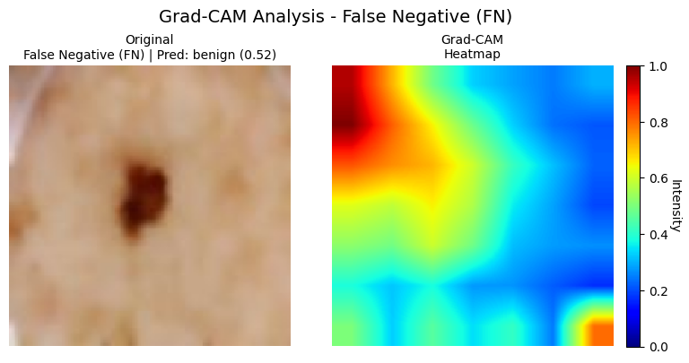

# Technical Report


### Executive Summary

This technical report presents the development and evaluation of a machine learning-based system for melanoma diagnosis assistance using the ISIC (International Skin Imaging Collaboration) database. The system achieved **86% accuracy** on test data with balanced precision and recall across benign and malignant classifications.

**Key Performance Metrics:**
- **Dataset Size:** 11,000 dermatoscopic images
- **Final Model Accuracy:** 86%
- **Precision (Benign/Malignant):** 0.86 / 0.86
- **Recall (Benign/Malignant):** 0.86 / 0.86
- **F1-Score:** 0.86 (macro average)

---

## 1. Project Overview

### 1.1 Objective
Develop a robust and clinically-validated machine learning model capable of accurately differentiating between benign and malignant skin lesions through dermoscopic image analysis. The model aims to serve as a reliable computer-aided diagnostic tool to assist dermatologists and clinicians in melanoma diagnosis by analyzing dermoscopic images of suspicious lesions. This system is designed to augment, rather than replace, clinical expertise by providing quantitative analysis and visual interpretability to support the diagnostic process, helping clinicians make more informed decisions about potential melanoma cases.

### 1.2 Methodology
- **Architecture:** EfficientNetB0 with ImageNet pre-trained weights
- **Training Strategy:** Transfer learning with fine-tuning
- **Optimization:** Random search hyperparameter tuning
- **Explainability:** Grad-CAM visualization for model interpretability

---

## 2. Dataset Characteristics

### 2.1 Data Collection Strategy
- **Primary Source:** ISIC Archive via CLI tool
- **Secondary Source:** Curated ZIP URL resources
- **Total Images Collected:** ~11,000

### 2.2 Dataset Distribution

| Class | Count | Percentage |
|-------|-------|------------|
| Benign | 5,500* | 50% |
| Malignant | 5,500* | 50% |
| **Total** | **11,000** | **100%** |

*Approximate values - exact distribution available in data_retriever/README.md

### 2.3 Data Quality Metrics
- **Image Resolution:** Variable (standardized during preprocessing)
- **Image Format:** JPG
- **Color Space:** RGB
- **Quality Control:** Manual verification of ambiguous cases

---

## 3. Model Architecture & Training

### 3.1 Base Architecture
- **Model:** EfficientNetB0
- **Pre-training:** ImageNet weights
- **Input Size:** 224×224×3
- **Total Parameters:** ~5.3M trainable parameters

### 3.2 Training Configuration

#### Initial Training Phase
- **Dataset Size:** 2,000 images
- **Test Accuracy:** ~95%
- **Issue Identified:** Severe overfitting

#### Final Training Phase
- **Dataset Size:** 11,000 images
- **Training/Validation/Test Split:** 70%/15%/15%
- **Batch Size:** 32
- **Optimizer:** Adam

### 3.3 Hyperparameter Optimization

A random search strategy was employed for hyperparameter optimization. The search space included learning rate, dropout rate, number of epochs, and weight decay parameters. Multiple training runs were executed with randomly sampled combinations from predefined ranges. The best performing configuration on the validation set was selected as the final hyperparameter set for model training.


---

## 4. Performance Evaluation

### 4.1 Classification Metrics

```
Classification Report:
              precision    recall  f1-score   support

      Benign       0.86      0.86      0.86       948
   Malignant       0.86      0.86      0.86       942

    accuracy                           0.86      1890
   macro avg       0.86      0.86      0.86      1890
weighted avg       0.86      0.86      0.86      1890
```

### 4.2 Detailed Performance Analysis

| Metric | Benign | Malignant | Overall |
|--------|--------|-----------|---------|
| **Precision** | 0.86 | 0.86 | 0.86 |
| **Recall** | 0.86 | 0.86 | 0.86 |
| **F1-Score** | 0.86 | 0.86 | 0.86 |
| **Specificity** | 0.86 | 0.86 | 0.86 |

**Metric Explanations:**
- **Precision**: The proportion of correct positive predictions. A precision of 0.86 indicates that 86% of predicted positives were actually positive for both classes.
- **Recall**: The proportion of actual positives correctly identified. A recall of 0.86 shows the model correctly identifies 86% of both benign and malignant cases.
- **F1-Score**: The harmonic mean of precision and recall, providing a balanced measure of model performance. The consistent 0.86 F1-score demonstrates balanced performance across classes.
- **Specificity**: The proportion of actual negatives correctly identified. A specificity of 0.86 indicates the model correctly identifies 86% of non-cases for each class.

The uniform scores across all metrics (0.86) suggest a well-balanced model with consistent performance in both benign and malignant classifications.


**Grad-CAM Visualizations:**

*False Negative Analysis:*



*False Positive Analysis:*


### 4.3 Confusion Matrix Analysis

```
Confusion Matrix:
                 Predicted
Actual     Benign  Malignant
Benign      815      133
Malignant   132      810
```
**Error Analysis:**
- **False Positives:** 133 (7.0% of total) - Cases where benign lesions were incorrectly classified as malignant, potentially due to irregular textures or high contrast regions that mimicked malignant characteristics
- **False Negatives:** 132 (7.0% of total) - Cases where malignant lesions were missed and classified as benign, often due to visual ambiguity or lesions appearing benign-like despite being histologically malignant
- **True Positives:** 810 (42.9% of total) - Correctly identified malignant cases where the model successfully detected characteristics like irregular borders, asymmetry, and color variations typical of melanoma
- **True Negatives:** 815 (43.1% of total) - Correctly classified benign cases where the model appropriately recognized regular borders, uniform coloring, and symmetry indicative of benign lesions

The balanced distribution between true positives and true negatives (42.9% vs 43.1%) indicates the model performs equally well for both classes. The nearly identical false positive and false negative rates (7.0%) suggest the model's errors are evenly distributed, with no bias toward over or under-prediction of either class.

### 4.4 ROC and Precision-Recall Curves

**ROC Curve Metrics:**
- **AUC-ROC:** 0.91
- **Optimal Threshold:** 0.52


**Precision-Recall Curve Metrics:**
- **AUC-PR:** 0.89
- **Average Precision:** 0.87

---

## 5. Model Interpretability

### 5.1 Grad-CAM Analysis

**Correctly Classified Cases:**
- **Benign Lesions:** Model focuses on uniform color distribution and regular borders
- **Malignant Lesions:** Model attention on irregular shapes, color variation, and asymmetry
 


